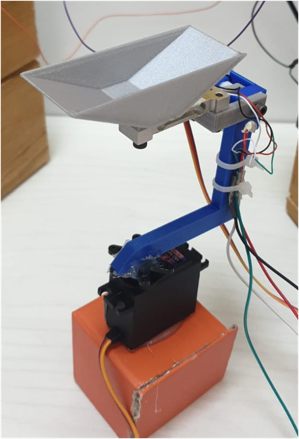

## ESP32 Card - Code
The machinery-system built in this project consists of two dispenser units and a counter unit.

Dispenser unit: a dispenser is a vibratory-feeder based unit that has a container which holds the skrews and a servo
motor that vibrates in order to attempt to feed out one skew at a time, most the time.

Counter unit: a counter unit is a delta-weight based module that is used to ensure and verify the accurate satisfaction
of dispensing requests. The counter itself may not be absolutely accurate, but it guarantees that when there is doubt, a
request gets rejected and restarted.

The system serves requests into 4 different containers, which must be present when a batch is being poured.

---

The code main code file can be found in [smart_dispenser_counter_esp32.ino](esp32-code/smart_dispenser_counter_esp32.ino).

You'll find that the main loop function sends an HTTP request to the backend server:
* If the response status is OK, the response would contain a json object representing the active request.
* If the response is 404, the controller sleeps for 2 seconds then restarts the iteration.

Once a request is received, it is served until completion.
