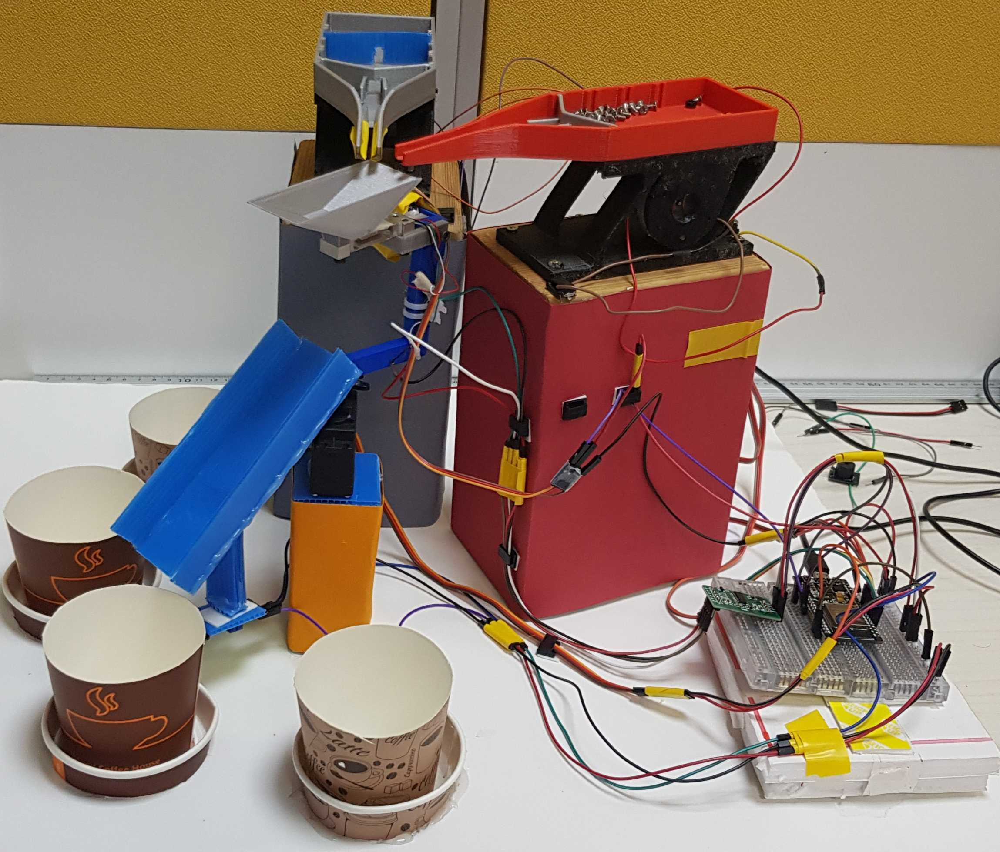
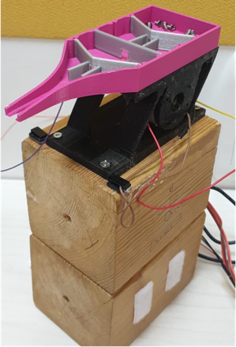
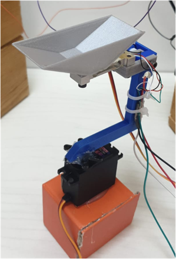

# SmartDispenserCounter
[](https://goreportcard.com/report/github.com/vMaroon/SmartDispenserCounter)
[](/LICENSE)

Visually-impaired employees in a MigdalOr factory face difficulties distinguishing between different kinds of screws / counting them.

Smart Dispenser-Counter is a machinery system that outputs a batch of screws per request:
* Users can request a batch of a number of screws of a certain type
* The dispenser outputs them from screws storages
* The counter verifies that the dispenser satisfied the request accurately



Index:
* [WebApp](#webapp)
* [ESP32 Card - Code](#esp32-card---code)
* [Backend Hierarchy](#backend-hierarchy)

---
## WebApp
Our frontend consists of a wix web-application that can be used on desktop/mobile comfortably.
The UI of wix is not provided in this repository, but the backend code is available.


For the code, check the [webapp directory](webapp/README.md).

---
## ESP32 Card - Code
The machinery-system built in this project consists of two dispenser units and a counter unit.

Dispenser unit: a dispenser is a vibratory-feeder based unit that has a container which holds the skrews and a servo
motor that vibrates in order to attempt to feed out one skew at a time, most the time.



Counter unit: a counter unit is a delta-weight based module that is used to ensure and verify the accurate satisfaction
of dispensing requests. The counter itself may not be absolutely accurate, but it guarantees that when there is doubt, a
request gets rejected and restarted.



The system serves requests into 4 different containers, which must be present when a batch is being poured.

The [code directory](ESP32) contains the code flashed on the ESP32 card that runs the system, and a variety of example 
modules that we found useful throughout the development of our project.

---
## Backend Hierarchy

### - REST-API Server [/pkg/rest-api](pkg/rest-api/server.go)
The server uses [gin-gotonic](github.com/gin-gonic) pkg to run a RESTful API listener. 
The supported endpoints can be found in registerAPI function.

### - DB [/pkg/db](pkg/db/db.go)
We designed our backend to be DB-agnostic: the RESTAPI server does not care 
about the specifics of the DB, it only requires a client that implements the [db.go](pkg/db/db.go) interface.

For the time being we chose to go with a low-effort [in-memory database](pkg/db/in-memory/in_memory_db.go) 
implementation. If anyone wishes to plug in any database, the interface must be implemented.

### - Data-types [/datatypes](datatypes/datatypes.go)
The [datatypes.go](datatypes/datatypes.go) file contains the structures used in our endpoints (currently DispenserJob).

### - Queries [/queries](queries)
The queries directory contains datatype-related query formats, e.g. URL query parameters for fetching dispenser jobs.

## Frontend
The [frontend](frontend) folder contains the code from Wix.

## Build

* [Makefile](Makefile)
* [Dockerfile](build/Dockerfile)
* [build scripts](build/scripts)

1.  Set the `REGISTRY` environment variable to hold the name of your docker registry:
    ```
    $ export REGISTRY=...
    ```

1.  Run the following command to build and push the image:
    ```
    make push-images
    ```
    
## Formatting

* [GCI](https://github.com/daixiang0/gci) for ordering imports.
* [gofumpt](https://github.com/mvdan/gofumpt) for formatting (a stricter tool than `go fmt`).
* `go fmt`

## Linting

* `go vet`
* [golangci-lint](https://github.com/golangci/golangci-lint), minimal version 1.43.0, the settings file is [.golangci.yaml](https://github.com/open-cluster-management/hub-of-hubs-spec-sync/blob/main/.golangci.yaml).
* [golint](https://github.com/golang/lint)

If you want to specify something as false-positive, use the [//nolint](https://golangci-lint.run/usage/false-positives/) comment.

If you see stale errors from [golangci-lint](https://github.com/golangci/golangci-lint), run `golangci-lint cache clean`.

## Tests

We did not implement any unit/e2e tests for this prototype. 
It is the developer's responsibility to build/test their code before **submitting PRs**.
