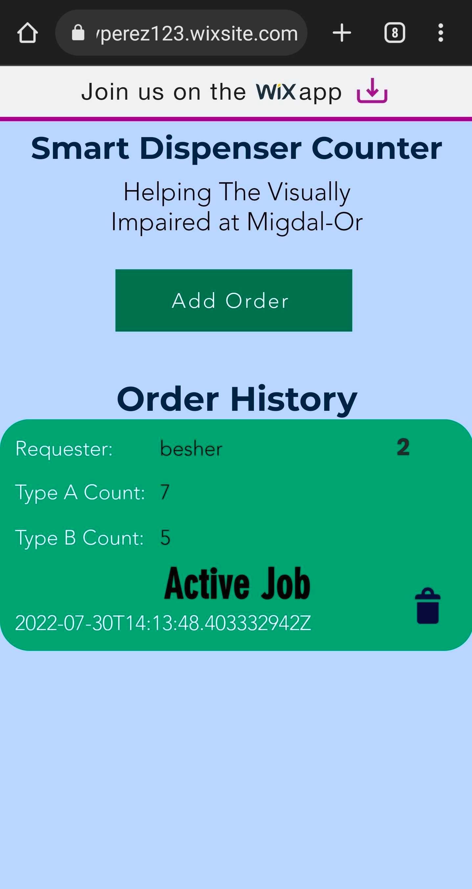
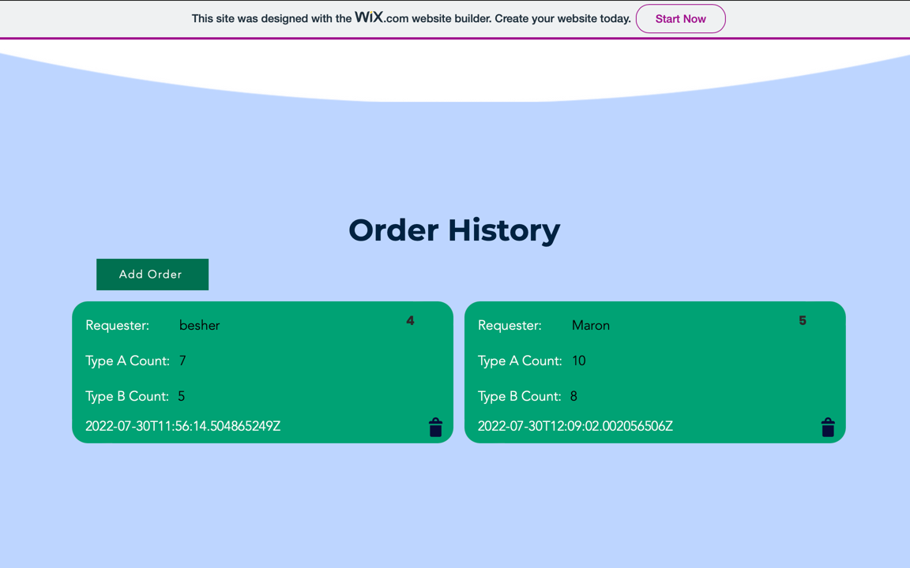

# Smart Dispenser Counter WebApp
Our frontend consists of a wix web-application that can be used on desktop/mobile comfortably.
The UI of wix is not provided in this repository, but the backend code is available.

The backend code is a collection of javascript modules that wrap the functionality required to communicate with and use
our RESTful API server.
---

## Mobile View

---

## Desktop View
